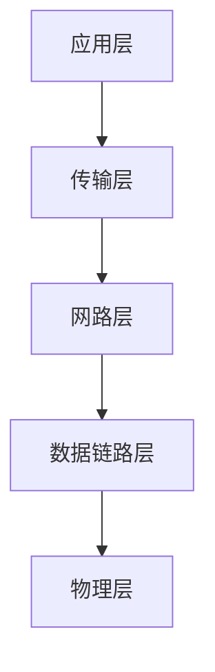

# http 协议原理

http+实践（4-3 没看完）

## http 请求头返回头

### General 部分

1.Request URL:<https://www.baidu.com>
2.Request Method: GET | POST |PUT | DELETE
3.Status Code:200 ok
4.Remote Address:170.30.68.94:8080
5.Referer Policy:strict-origin-when-cross-origin(不发送 query 和路径等)

### Request Header 部分

1. Accept
2. Accept-Language:ZH-CN;zh;q=0.9
3. Cache-Control:no-chache | max-age | no-store
4. Connection:keep-alive
5. Content-Type:'application/json'
6. Cookie
7. Host:gz.meituan.com(域名)
8. Origin:<https://gz.meituan.com>
9. Referer:<https://gz.meituan.com/>
10. User-Agent: Mozilla/5.0 (Windows NT 10.0; Win64; x64) AppleWebKit/537.36 (KHTML, like Gecko) Chrome/89.0.4389.128 Safari/537.36

### Response Header 部分

1. Access-Control-Allow-Credentials: true
2. Access-Control-Allow-Origin: <http://gz.meituan.com>
3. Connection: keep-alive
4. Content-Length: 2
5. Content-Type: application/json; charset=utf-8
6. Date: Thu, 22 Apr 2021 01:51:32 GMT
7. Server: openresty

## 示例

- 输入 URL 打开网页
- AJAX 获取数据
- img 标签加载图片

## 网络模型

1. 物理层:主要作用定义物理设备如何传输数据:电脑硬件,网卡端口,网线等
2. 数据链路层:在通信的实体间建立数据链路传输;r 软件服务通过物理的设备进行链路的连接
3. 网络层:为数据在节点之间的传输创建逻辑链路
4. 传输层:tcp ip udp 协议
5. 应用层:实现 http 协议，给应用软件提供了很多服务,构建与 tcp 协议之上,屏蔽网络传输相关细节

## HTTP/0.9

- 只有一个命令 GET
- 没有 HEADER 等描述数据的信息
- 服务器发送完毕,就关闭 TCP 连接

## HTTP/1.0

- 增加了很多命令
- 增加 status code 和 header
- 多字符集支持、多部分发送、权限、缓存等

## Http/1.1

浏览器允许 tcp 一次并发创建 6 个
有一定顺序请求在 tcp 上
连接不能并发请求加载数据有先后顺序

- 持久连接
- pipeline
- 增加 host 和其他一些命令

## HTTP2

- 所有数据以二进制传输(以前是字符串传输)
- 同一个连接里面发送多个请求不需要按照顺序来
- 头信息压缩以及推送等提高效率的功能

## HTTP 长连接

## https

- 加密
  公钥私钥主要用在三次握手中
  1. 私钥:只会放到服务器上
  2. 公钥

## 为什么要三次握手

防止服务端开启无用的连接

## URI(uniform Resource identifier) 统一资源标志符

用来唯一标识互联网上的信息资源;包含 URL(Uniform Resource Locator)和 URN(永久统一资源定位符)在资源移动之后还能被找到

## WebSocket 与 HTTP

webSocket 协议 2008 年诞生,2011 年成为国际标准.webSocket 最大特点就是，服务器可以主动向客户端推送信息，客户端也可以主动向服务器发送信息,是真正的双向平等对话。
http1.0 和 1.1 所为的 keep-alive,吧多个 HTTP 请求合并为一个。websocket 为了兼容现有浏览器,所以在握手阶段使用了 HTTP.
WebSocket 的其他特点：

1. 建立在 TCP 协议之上，服务器端的实现比较容易
2. 与 HTTP 协议有着良好的兼容性。默认端口也是 80 和 443，并且握手阶段采用 HTTP 协议，因此握手时不容易屏蔽，能通过各种 HTTP 代理服务器
3. 数据格式比较轻量，性能开销小，通信高效
4. 可以发送文本，也可以发送二进制数据
5. 没有同源限制，客户端可以与任意服务器通信
6. 协议标识符是 ws（如果加密，则为 wss），服务器网址就是 URL

## websocket 是什么协议有什么作用

是持久性的协议,相对于 http 这种非持久性来说

- ajax 轮询的原理非常简单，让浏览器隔个几秒就发送一次请求，询问服务器是否有新信息
- long poll 其实原理跟 ajax 轮询 差不多，都是采用轮询的方式，不过采取的是阻塞模型（一直打电话，没收到就不挂电话），也就是说，客户端发起请求后，如果没消息，就一直不返回 Response 给客户端。直到有消息才返回，返回完之后，客户端再次建立连接，周而复始。
- 两种都是非常消耗资源的.ajax 轮询需要服务器有很快的处理速度和资源.long poll 需要有很高的并发,就是说同时接待客户的能力.

## websocket 协议的优缺点

优点：websocket 协议一旦建立后，相互沟通所消耗的请求头是很小的.服务器可以向客户端推送消息了
缺点：少部分浏览器不支持,浏览器支持的程度与方式有区别
运用场景：即时聊天通信、多玩家游戏、在线协调编辑、实时数据流的拉取与推送、实时地图位置

## Cache-Control 含义和使用

- 可缓存行

1. public:客户端和服务器都可以缓存(http 任何地方都可以缓存)
2. private(只有浏览器缓存)代理服务器不能缓存
3. no-cache(本地可以存储缓存但是要服务器验证才能用)

- 到期

1. max-age
2. s-maxage: 设置代理服务器缓存时间
3. max-stale

- 重新验证

1. must-revalidate
2. proxy-revalidate

- 其他

1. no-store:没有任何缓存 浏览器和代理服务器都不缓存
2. no-transform
3. vary:自定义头,每次请求自定义头相同才会缓存

## Last-modified(上次修改的时间) 和 Etag 使用

- last-modified 和 if-modified-Since
  对比上次修改时间以验证资源是否需要更新
- Etag(数据签名) 常见进行 Hash 计算根据内容/if-match 或者 if-None-match
  对比资源的签名判断是否使用缓存

## Http 状态码

新 url 表示第一次请求返回的 location

- 301: 永久重定向,表示请求的资源分配了新 url,以后应该使用新 URl,
- 302: 临时重定向,表示资源临时分配了新 url,本次请求暂且使用新 url.
- 301 和 302 区别: 302 临时性重定向，重定向的 url 还有可能还会该改变
- 303:表示请求资源路径发送改变,使用 GET 方法请求新 URL.
- 304: 服务器资源未改变,可直接使用客户端未过期的缓存
- 400:表示请求的报文存在语法错误;比如 url 含有非法字符、提交 json 数据格式错误
- 405: 请求的方式(get、post、delete)方法与后台规定的方式不符合
- 415: 后台程序不支持提交的 content-type

## cookie、session 和 localStorage

- cookie
  大小小于 4kb,尽量保证 cookie 个数小于 20 个
  max-age 和 expires 设置过期时间; Secure 只在 https 的时候发送; HttpOnly 无法通过 js 中 document.cookie 访问．
  验证原理是通过 header 里 host 字段
  cookie 没有设置过期时间,默认浏览器关闭了就失效了
  二级域名(test.a.com)可以访问到一级域名(a.com)里 cookie;
  lisp.com 这种形式的域名才是一级域名;lisp 是域名主体，.com 是域名后缀，可以是.net 也是域名后缀
  二级域名是一个一级域名下面的主机名，它是在一级域名前面加上一个字符串 asdx.lisp.com
  不能跨域设置 cookie 如不能 a.test.come 不能给 test.com 设置 cookie;二级域名是可以访问到一级域名下的 cookie; 服务端设置 cookie 时设置 domain=test.com;
  经常用 cookie 保持 session
- session
  数据保存在服务端
- localStorage
  本地存储接触 cookie 4kb 的限制,一般大小为 5M,只支持 string 类型的存储,没有时间限制
  局限性:
  1. 浏览器的大小不统一,并且 IE8 以上版本才支持 localStorage 这个属性
  2. localStorage 在浏览器的隐私模式下面是不可读取的
  3. localStorage 不能被爬虫抓取到
  4. localStorage 的使用也是遵循同源策略的，所以不同的网站直接是不能共用相同的 localStorage
     localStorage 和 sessionStorage 区别
     同一浏览器的相同域名和端口的不同页面间可以共享相同的 localStorage,但是不同页面间无法共享 sessionStorage 的信息.
     http://www.a.com/a.js 和 http://script.a.com/b.js 主域相同,子域不同 不允许通讯

## 数据协商

- header
  Accept
  Accept-Encoding
  Accept-Language
  User-Agent:客户端的信息
- 返回
  Content-type:返回数据类型
  Content-Encoding:数据压缩类型
  Content-Language:返回什么语言

## csp(Content-Security-Policy)

需要配置网络服务器返回 csp 的 http 头部
default-src 限制全局 可以防止 xss 攻击,但是不能限制表单提交别的域名并跳转

- form-action:用来限制表单域名的跳转范围
- img-src
- script-src
- Content-Security-Policy:default-scr 'self'
  所有内容均来自站点的同一个源(不包括其子域名);不同域名下的内容加载不进来
- report-url
