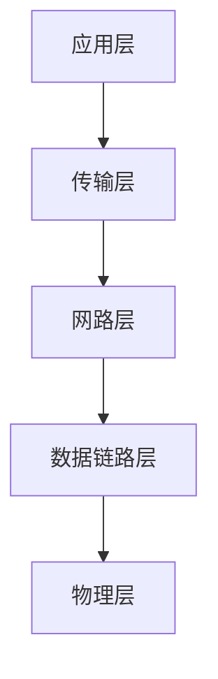

# http 协议原理

学习书籍:计算机图形学
http 协议原理+实践 web（视频开完）
大话 HTTP 协议(看完)

## http 特点

- 支持客户/服务器模式
  客户/服务器模式工作的方式是由客户端向服务器发出请求,服务器端响应请求,并进行相应服务
- 简单快速
- 灵活
  http 允许传输任意类型的数据对象
- 无连接
  无连接的含义是限制每次连接只处理一个请求;服务器处理完客户的请求,并收到客户的应答后,即断开连接
- 无状态

## cookie、session 和 localStorage

- cookie
  cookie 可以是 http 有状态能记忆
  大小小于 4kb,尽量保证 cookie 个数小于 20 个
  max-age 和 expires 设置过期时间; Secure 只在 https 的时候发送; HttpOnly 无法通过 js 中 document.cookie 访问．
  验证原理是通过 header 里 host 字段
  cookie 没有设置过期时间,默认浏览器关闭了就失效了
  二级域名(test.a.com)可以访问到一级域名(a.com)里 cookie;
  lisp.com 这种形式的域名才是一级域名;lisp 是域名主体，.com 是域名后缀，可以是.net 也是域名后缀
  二级域名是一个一级域名下面的主机名，它是在一级域名前面加上一个字符串 asdx.lisp.com
  不能跨域设置 cookie 如不能 a.test.come 不能给 test.com 设置 cookie;二级域名是可以访问到一级域名下的 cookie; 服务端设置 cookie 时设置 domain=test.com;
  经常用 cookie 保持 session
- session
  数据保存在服务端
- localStorage
  本地存储接触 cookie 4kb 的限制,一般大小为 5M,只支持 string 类型的存储,没有时间限制
  局限性:
  1. 浏览器的大小不统一,并且 IE8 以上版本才支持 localStorage 这个属性
  2. localStorage 在浏览器的隐私模式下面是不可读取的
  3. localStorage 不能被爬虫抓取到
  4. localStorage 的使用也是遵循同源策略的，所以不同的网站直接是不能共用相同的 localStorage
     localStorage 和 sessionStorage 区别
     同一浏览器的相同域名和端口的不同页面间可以共享相同的 localStorage,但是不同页面间无法共享 sessionStorage 的信息.
     http://www.a.com/a.js 和 http://script.a.com/b.js 主域相同,子域不同 不允许通讯

## http 请求头返回头

### General 部分

1.Request URL:<https://www.baidu.com>
2.Request Method: GET | POST |PUT | DELETE
3.Status Code:200 ok
4.Remote Address:170.30.68.94:8080
5.Referer Policy:strict-origin-when-cross-origin(不发送 query 和路径等)

### Request Header 部分

1. Accept
2. Accept-Language:ZH-CN;zh;q=0.9
3. Cache-Control:no-chache | max-age | no-store
4. Connection:keep-alive
5. Content-Type:'application/json'
6. Cookie
7. Host:gz.meituan.com(域名)
8. Origin:<https://gz.meituan.com>
9. Referer:<https://gz.meituan.com/>
10. User-Agent: Mozilla/5.0 (Windows NT 10.0; Win64; x64) AppleWebKit/537.36 (KHTML, like Gecko) Chrome/89.0.4389.128 Safari/537.36
    cors 请求有
    Vary:Origin:可以让同一个 URL 有多份缓存
    原理：是让同一个 URL 根据某个请求头的不同而使用不同的缓存
    比如: Vary: Accept-Encoding 表示客户端要根据 Accept-Encoding 请求头的不同而使用不同的缓存
    在 CORS 的场景下，我们需要使用 Vary: Origin 来保证不同网站发起的请求使用各自的缓存

### Response Header 部分

1. Access-Control-Allow-Credentials: true
2. Access-Control-Allow-Origin: <http://gz.meituan.com>
3. Connection: keep-alive
4. Content-Length: 2
5. Content-Type: application/json; charset=utf-8
6. Date: Thu, 22 Apr 2021 01:51:32 GMT
7. Server: openresty

## 示例

- 输入 URL 打开网页
- AJAX 获取数据
- img 标签加载图片

## http 协议的瓶颈

1. 一条连接只发送一个请求
2. 请求只能从客户端开始。客户端不可以接受出响应以外的指令
3. 请求/响应头部不经压缩就发送
4. 每次互相发送相同的头部造成的浪费较多
5. 非强制压缩发送

## TCP/IP 协议族分层

TCP/IP 协议族是由一个四层协议组成的系统:应用层、传输层、网络层、数据链路层

## 网络模型

1. 物理层:主要作用定义物理设备如何传输数据:电脑硬件,网卡端口,网线等
2. 数据链路层:在通信的实体间建立数据链路传输;r 软件服务通过物理的设备进行链路的连接
3. 网络层:为数据在节点之间的传输创建逻辑链路
4. 传输层:tcp ip udp 协议
5. 应用层:实现 http 协议，给应用软件提供了很多服务,构建与 tcp 协议之上,屏蔽网络传输相关细节

## HTTP/0.9

- 只有一个命令 GET
- 没有 HEADER 等描述数据的信息
- 服务器发送完毕,就关闭 TCP 连接

## HTTP/1.0

- 默认适用的是短连接。也就是说,浏览器和服务器没进行一次 HTTP 操作,就建立一次连接,结束就中断
- 增加了很多命令
- 增加 status code 和 header
- 多字符集支持、多部分发送、权限、缓存等

## Http/1.1

增加了长连接
浏览器允许 tcp 一次并发创建 6 个
有一定顺序请求在 tcp 上
连接不能并发请求加载数据有先后顺序

- 持久连接
- pipeline
- 增加 host 和其他一些命令

## HTTP2

- 缺点:

1. 队头阻塞
2. 建立连接的握手延迟大

- 优势:

1. 信道复用
2. 分帧传输
3. Server Push

- 所有数据以二进制传输(以前是字符串传输)
- 同一个连接里面发送多个请求不需要按照顺序来
- 头信息压缩以及推送等提高效率的功能

## HTTP 长连接

## https

HTTP+TLS(传输层加密协议)

- 加密
  对称加密和非对称加密
  公钥私钥主要用在三次握手中
  1. 私钥:只会放到服务器上
  2. 公钥
- 握手
  1. 浏览器先生成随机数 Random 和加密套件
  2. 服务端也生成一个随机数 Random 选择一个客户端支持的加密套件;并发送一个证书(公钥)
  3. 客户端拿到证书后,发送加密后的随机数
  4. 服务的拿到私密钥进行解密
- https 对性能的影响
  网络耗时 RTT

## 为什么要三次握手

三次可以确定自己的发送和接受数据的能力
防止服务端开启无用的连接

## URI(uniform Resource identifier) 统一资源标志符

URN：好像一个人名字,URL 就像一个人的地址
用来唯一标识互联网上的信息资源;包含 URL(Uniform Resource Locator)和 URN(永久统一资源定位符)在资源移动之后还能被找到

## WebSocket 与 HTTP

- 即时通信实现原理:

1. ajax 轮询,使用定时器每隔 1s 时间发送 ajax 到后台

webSocket 协议 2008 年诞生,2011 年成为国际标准.webSocket 最大特点就是，服务器可以主动向客户端推送信息，客户端也可以主动向服务器发送信息,是真正的双向平等对话。
http1.0 和 1.1 所为的 keep-alive,吧多个 HTTP 请求合并为一个。websocket 为了兼容现有浏览器,所以在握手阶段使用了 HTTP.
WebSocket 的其他特点：

1. 建立在 TCP 协议之上，服务器端的实现比较容易
2. 与 HTTP 协议有着良好的兼容性。默认端口也是 80 和 443，并且握手阶段采用 HTTP 协议，因此握手时不容易屏蔽，能通过各种 HTTP 代理服务器
3. 数据格式比较轻量，性能开销小，通信高效
4. 可以发送文本，也可以发送二进制数据
5. 没有同源限制，客户端可以与任意服务器通信
6. 协议标识符是 ws（如果加密，则为 wss），服务器网址就是 URL

## websocket 是什么协议有什么作用

是持久性的协议,相对于 http 这种非持久性来说

- ajax 轮询的原理非常简单，让浏览器隔个几秒就发送一次请求，询问服务器是否有新信息
- long poll 其实原理跟 ajax 轮询 差不多，都是采用轮询的方式，不过采取的是阻塞模型（一直打电话，没收到就不挂电话），也就是说，客户端发起请求后，如果没消息，就一直不返回 Response 给客户端。直到有消息才返回，返回完之后，客户端再次建立连接，周而复始。
- 两种都是非常消耗资源的.ajax 轮询需要服务器有很快的处理速度和资源.long poll 需要有很高的并发,就是说同时接待客户的能力.

## websocket 协议的优缺点

优点：websocket 协议一旦建立后，相互沟通所消耗的请求头是很小的.服务器可以向客户端推送消息了
缺点：少部分浏览器不支持,浏览器支持的程度与方式有区别
运用场景：即时聊天通信、多玩家游戏、在线协调编辑、实时数据流的拉取与推送、实时地图位置

## http 报文头分四类

通用报文头、请求报文头、响应报文头、实体报文头

- 通用报文头

  - Cache-Control:

  1. no-cache:缓存,但是浏览器适用缓存前,都会请求服务器判断缓存资源是否是最新的
  2. no-store:没有任何缓存 浏览器和代理服务器都不缓存

  - Connection
  - Via:为了追踪请求和响应报文测传输路径
  - pragma
  - Date

- 实体报文头
  - allow:服务器通知客户端服务器这边所支持的请求方法;服务器找不到请求方法就返回 405
  - content-Encoding:说明报文实体的编码方法
  - content-language:报文实体使用的自然语言
  - content-length:报文实体的字节长度
- 响应报文头
  - Accept-Ranges:告诉客户端服务器那边支持范围请求
  - age:告知客户端源服务器在多久进行的响应
  - Etag:当前请求的服务器资源（图片，HTML 页面等）所对应的一个独有的字符串
  - Location
  - server:表明了服务器端使用的服务器型号
  - vary:源服务器会向代理服务器传达关于本地缓存使用方法的命令
  - WWW-Authenticate:用来指定客户端的认证方案（Basic 或者 Digest）

## Cache-Control 含义和使用

- 可缓存行

1. public:客户端和服务器都可以缓存(http 任何地方都可以缓存)
2. private(只有浏览器客户端缓存)代理服务器不能缓存
3. no-cache(本地可以存储缓存但是要服务器验证才能用)

- 到期

1. max-age:请求缓存后 x 秒不再发起请求
2. s-maxage: 设置代理服务器缓存时间(只对 CDN 缓存有效)
3. max-stale

- 重新验证

1. must-revalidate:表示缓存服务器在返回资源是,必须向资源服务器确认其缓存的有效性
2. proxy-revalidate:代理服务器响应浏览器，要求其提供代理身份验证信息

- 其他

1. no-transform:无论请求还是响应,都不能在传输的过程中改变报文体的媒体类型
2. vary:自定义头,每次请求自定义头相同才会缓存

## Last-modified(上次修改的时间) 和 Etag 使用

- last-modified 和 if-modified-Since
  对比上次修改时间以验证资源是否需要更新
- Etag(数据签名) 常见进行 Hash 计算根据内容/if-match 或者 if-None-match
  对比资源的签名判断是否使用缓存

## Http 状态码

新 url 表示第一次请求返回的 location

- 202 已接受,但是未处理完成
- 206 客户端只想请求部分内容,服务器成功处理了部分 get 请求(断点续传)
- 301: 永久重定向,表示请求的资源分配了新 url,以后应该使用新 URl,
- 302: 临时重定向,表示资源临时分配了新 url,本次请求暂且使用新 url.
- 301 和 302 区别: 302 临时性重定向，重定向的 url 还有可能还会该改变
- 303:表示请求资源路径发送改变,使用 GET 方法请求新 URL.
- 304: 服务器资源未改变,可直接使用客户端未过期的缓存
- 403: 服务器理解请求客户端请求,但是拒绝执行此请求
- 400:表示请求的报文存在语法错误;比如 url 含有非法字符、提交 json 数据格式错误
- 405: 请求的方式(get、post、delete)方法与后台规定的方式不符合
- 406 服务器无法返回莫类型的数据
- 412: 便是客户端错误,意味着对于目标资源的访问请求被拒绝
- 413:服务器拒绝处理当前请求，因为该请求提交的实体数据大小超过了服务器愿意或者能够处理的范围
- 414:请求的 URI 长度超过了服务器能够解释的长度，因此服务器拒绝对该请求提供服务
- 415: 对于当前请求的方法和所请求的资源，请求中提交的实体并不是服务器中所支持的格式，因此请求被拒绝
- 502: 充当网关或代理服务器,从远端服务器接受了一个无效的请求
- 503: 服务器当前不能处理客户端的请求，一段时间后可能恢复正常，
- 504:作为网关或者代理工作的服务器尝试执行请求时，未能及时从上游服务器（URI 标识出的服务器，例如 HTTP、FTP、LDAP）或者辅助服务器（例如 DNS）收到响应。

## 数据协商

- header
  Accept:浏览器端可以接受的媒体类型
  Accept-Encoding:浏览声明接受的压缩方法
  Accept-Language:浏览器申明接收的语言
  User-Agent:客户端的信息
- 返回
  Content-type:返回数据类型
  Content-Encoding:数据压缩类型
  Content-Language:返回什么语言

## csp(Content-Security-Policy)

需要配置网络服务器返回 csp 的 http 头部
default-src 限制全局 可以防止 xss 攻击,但是不能限制表单提交别的域名并跳转

- form-action:用来限制表单域名提交到源
- img-src
- script-src
- style-scr
- media-src
- frame-src
- font-src
- Content-Security-Policy:default-scr 'self'
  所有内容均来自站点的同一个源(不包括其子域名);不同域名下的内容加载不进来
- report-url
- 指令的值
  1. 允许任何内容
  2. none 不需要任何内容
  3. self 允许同源内容
  4. data 允许 data:协议（如 base64 编码的图片）

## ssl 加密解密原理

1.  客户端向服务器发送请求(client hello)
2.  服务器回应客户端的请求(server hello);并且返回数字证书
3.  客户端的浏览器进入数字证书认证环节,这部门是浏览器内置的 TLS 完成的
    1. 首先用内置证书列表中索引,找到服务器下发证书对应的机构,取出改机构颁发的公钥,没有找到则不可信任
    2. 用机构的证书公钥解密得到证书的内容和签名(网站的网址和网站的公钥等)
    3. 浏览器生成一个随机数 R,并使用网站公钥对 R 进行加密
4.  浏览器加密的 R 传送给服务器
5.  服务器用自己的私钥解密得到 R
6.  服务器已 R 为秘钥使用了对称加密算法加密网页内容传输给浏览器
7.  浏览器以 R 为秘钥使用之前约定的好的解密算法获取网页内容
