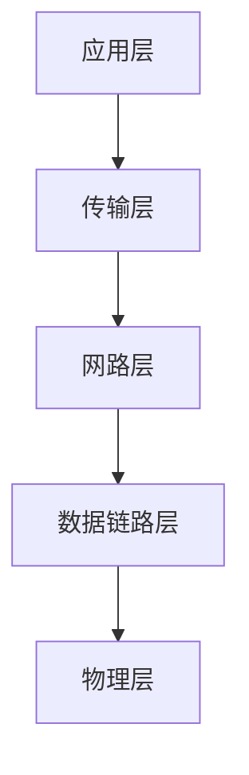

# http 协议原理

http+实践（第二章看完）

## 示例

- 输入 URL 打开网页
- AJAX 获取数据
- img 标签加载图片

## 网络模型

1. 物理层:主要作用定义物理设备如何传输数据:电脑硬件,网卡端口,网线等
2. 数据链路层:在通信的实体间建立数据链路传输;r软件服务通过物理的设备进行链路的连接
3. 网络层:为数据在节点之间的传输创建逻辑链路
4. 传输层:tcp ip udp 协议
5. 应用层:实现http协议，给应用软件提供了很多服务,构建与tcp 协议之上,屏蔽网络传输相关细节

## HTTP/0.9

- 只有一个命令 GET
- 没有 HEADER 等描述数据的信息
- 服务器发送完毕,就关闭 TCP 连接

## HTTP/1.0

- 增加了很多命令
- 增加 status code 和 header
- 多字符集支持、多部分发送、权限、缓存等

## Http/1.1

- 持久连接
- pipeline
- 增加 host 和其他一些命令

## HTTP2

- 所有数据以二进制传输(以前是字符串传输)
- 同一个连接里面发送多个请求不需要按照顺序来
- 头信息压缩以及推送等提高效率的功能

## 为什么要三次握手

防止服务端开启无用的连接

## URI(uniform Resource identifier) 统一资源标志符

用来唯一标识互联网上的信息资源;包含 URL(Uniform Resource Locator)和 URN(永久统一资源定位符)在资源移动之后还能被找到
